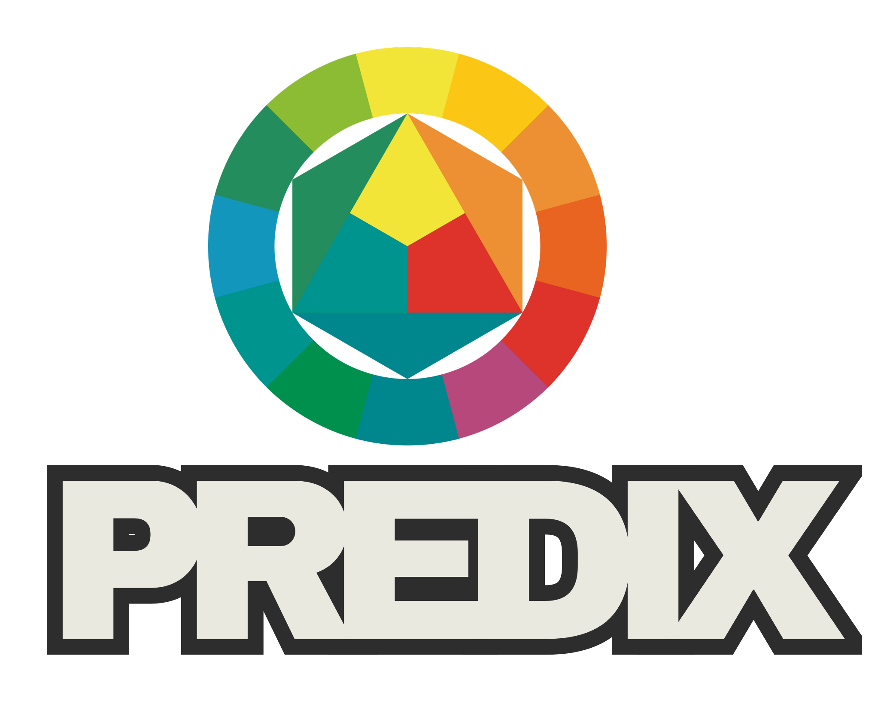

<div align="center">
  
</div>

<div align="center">

**Predix** is an end-to-end Big Data & Machine Learning platform for e-commerce behavioral intelligence.  
It predicts **churn**, scores **upsell/cross-sell opportunity**, and delivers **RFM segmentation** at scale.

[](https://python.org)
[](https://spark.apache.org)
[](https://mlflow.org)
[](https://airflow.apache.org)
[](https://getdbt.com)
[](https://vercel.com)

</div>

---

## What Predix Delivers

| Business Question | Predix Output | Business Value |
|---|---|---|
| Who will stop buying next month? | Churn probability score [0–1] per user | Retention campaigns before the loss |
| Where is demand not converting? | Upsell opportunity score per category | Targeted promotions on high-gap categories |
| Who are the most valuable customers? | RFM segment (Champions → Lost) | Personalised CRM playbooks |
| Which categories are bought together? | Cross-sell affinity matrix | Bundle offers & recommendation widgets |

---

## Architecture

```
Raw Events (CSV / Kafka)
    │
    ▼
PySpark Ingestion ──► Bronze Layer (Parquet / Delta)
    │
    ▼
dbt Silver ──► events_cleaned, sessions, user_daily_agg
    │
    ▼
dbt Gold ──► customer_rfm, churn_features, upsell_features   ◄── Snowflake MPP
    │
    ▼
MLflow Experiments ──► Logistic Regression │ Random Forest │ Gradient Boosting
    │                        ▼
    │                  Model Registry (champion promotion)
    ▼
Batch Scoring (Airflow @daily) ──► churn_scores.parquet, upsell_scores.parquet
    │
    ├──► FastAPI  ─── /api/v1/score/churn/{uid}
    │                 /api/v1/score/upsell/{uid}
    │                 /api/v1/segment/{uid}
    │
    └──► Static Dashboard (Vercel) ──► Plotly.js charts, live filters, 3D scatter
```

---

## Tech Stack — Why Each Was Chosen

### Apache Spark / PySpark
**Why:** The dataset is 93M+ rows (~14 GB). At e-commerce scale (50–500M events/day), pandas locks up. PySpark distributes processing across a cluster, enabling the same code to run on 14 GB today or 14 TB tomorrow — zero architectural refactor needed.

### Apache Airflow
**Why:** ML pipelines need reliable scheduling, dependency management, and retry logic. Airflow's DAG model makes the full pipeline auditable and observable. Every run is logged, every failure is alertable, and backfills are trivial.

### Snowflake + dbt
**Why:** Snowflake is MPP (Massively Parallel Processing) — it separates compute from storage, scales automatically, and charges only for what you use. dbt adds software-engineering practices to SQL: version control, tests, documentation, and lineage. The Bronze → Silver → Gold medallion architecture ensures clean separation of concerns.

### MLflow
**Why:** Without experiment tracking, model development is irreproducible. MLflow logs every hyperparameter, metric, and artefact for all three models, enabling A/B comparison and one-click champion promotion via the Model Registry.

### Gradient Boosting (XGBoost / sklearn GB)
**Why:** GBM consistently outperforms Logistic Regression and Random Forest on tabular churn problems with class imbalance. It handles non-linear interactions between RFM features natively. The Random Forest serves as an ensemble baseline; Logistic Regression serves as the interpretable baseline for regulatory audits.

### FastAPI
**Why:** Async-native, Pydantic-validated, auto-documented. Serving batch scores in < 10ms via in-memory Parquet is sufficient for personalisation use cases without needing a real-time feature store at this scale.

### Plotly.js + Vercel
**Why:** The entire dashboard is pre-computed JSON + static HTML. There is no server to maintain — Vercel deploys it globally on a CDN in seconds. Plotly.js provides interactive 3D charts, heatmaps, ROC curves, and 3D RFM scatter out of the box without any server-side rendering.

---

## Dashboard Tabs

| Tab | Charts | Key Insight |
|---|---|---|
| **Overview** | Daily event volume (area), Funnel, Event split donut, Category revenue, Daily revenue | Executive pulse — what's happening in the store |
| **Churn Intelligence** | Gauge, Cohort bar, RFM scatter, Segment bar, **3D RFM scatter** | Who is at risk and why |
| **Products & Categories** | Treemap, Top brands, Grouped bar, Avg price, Conversion rate, Top-20 table | What sells, what doesn't |
| **User Behavior** | Heatmap (hour×weekday), Hourly curve, Weekday bar, Session depth, Cumulative revenue, Ratio | When and how customers browse |
| **ML Intelligence** | ROC curves (3 models), Feature importance, Churn score histogram, Affinity matrix, Upsell scores, Segment action table | Model validation and scoring outputs |
| **Architecture** | Pipeline diagram, Tech stack chips, Model cards, Feature store schema, Airflow DAG specs, dbt layers | Full technical documentation embedded in the dashboard |

---

## Quickstart

### 1. Install dependencies
```bash
pip install -r requirements.txt
```

### 2. Generate dashboard data
```bash
python scripts/generate_dashboard_data.py
```
This samples 2M rows per CSV, trains all ML models, and writes `dashboard/data/dashboard_data.json`.  
Expected runtime: **3–8 minutes** depending on hardware.

### 3. Open the dashboard locally
```
dashboard/index.html   ← open directly in browser (no server needed)
```
Or serve it:
```bash
cd dashboard && python -m http.server 3000
# → http://localhost:3000
```

### 4. Deploy to Vercel
```bash
npm i -g vercel
vercel --prod
```
Vercel reads `vercel.json` and serves the `dashboard/` directory globally.

---

## Running the Full Pipeline (Production)

```bash
# 1. Start Airflow scheduler
airflow scheduler &
airflow webserver --port 8080 &

# 2. Train and register models manually
python pipeline/models/train_and_register.py \
  --data-dir ./dataset \
  --mlflow-uri ./mlruns

# 3. Start FastAPI server
uvicorn api.main:app --reload --port 8000

# 4. Check API
curl http://localhost:8000/health
curl http://localhost:8000/api/v1/metrics/overview
```

---

## Business Value & Scalability

### Immediate ROI Levers
- **Churn prevention**: Identifying the top 10% highest-churn-risk users enables targeted retention campaigns. Retaining even 5% of churners at an average order value of $125 generates measurable incremental revenue.
- **Upsell conversion**: Categories with high opportunity scores (high views, low conversions) are ideal for flash promotions. A 1% lift in conversion rate on electronics alone represents significant revenue.
- **Champion nurturing**: The Champions segment (top RFM) deserves a VIP loyalty programme — they have the highest LTV and the lowest churn risk.

### How It Scales

| Dimension | Today (demo) | Production at scale |
|---|---|---|
| Volume | 4M sampled events | 500M events/day → Spark auto-scales |
| Storage | Local CSV | Snowflake + Delta Lake (petabyte-ready) |
| Latency | Batch (daily) | Near-real-time with Kafka + Spark Streaming |
| Models | 3 classifiers | Model ensemble + A/B testing via MLflow |
| API | Single instance | Kubernetes HPA + load balancer |
| Dashboard | Static JSON | Live Snowflake connector via dbt exposures |

---

## Project Structure

```
Predix/
├── asset/                        ← Logos
├── dataset/                      ← Raw CSVs (not versioned)
├── dashboard/                    ← Static site → Vercel
│   ├── index.html
│   ├── js/app.js
│   ├── assets/
│   └── data/dashboard_data.json  ← Generated by scripts/
├── scripts/
│   └── generate_dashboard_data.py
├── pipeline/
│   ├── ingestion/pyspark_ingestion.py
│   ├── feature_store/feature_engineering.py
│   ├── models/churn_model.py
│   ├── models/upsell_model.py
│   ├── models/train_and_register.py
│   └── scoring/batch_scoring.py
├── airflow/dags/
│   ├── dag_01_ingestion.py
│   ├── dag_02_feature_engineering.py
│   ├── dag_03_model_training.py
│   └── dag_04_batch_scoring.py
├── dbt/models/
│   ├── bronze/raw_events.sql
│   ├── silver/events_cleaned.sql
│   └── gold/customer_rfm.sql / churn_features.sql / upsell_features.sql
├── api/main.py                   ← FastAPI scoring server
├── vercel.json
├── requirements.txt
├── requirements-pipeline.txt
└── .gitignore
```

---

## Dataset

**Source:** [Kaggle — eCommerce behavior data from multi category store](https://www.kaggle.com/datasets/mkechinov/ecommerce-behavior-data-from-multi-category-store)  
**Period:** October–November 2019 | **Raw size:** ~14 GB | **Rows:** ~93 million  
**Schema:** `event_time, event_type, product_id, category_id, category_code, brand, price, user_id, user_session`

---

<div align="center">
Built as a high-impact international portfolio project · Stack: PySpark · Airflow · Snowflake · dbt · MLflow · FastAPI · Plotly.js · Vercel
</div>
